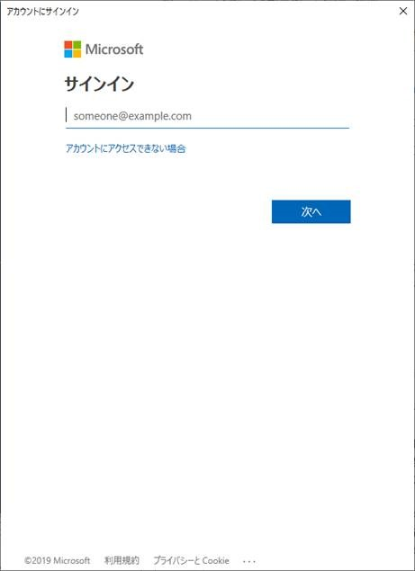

こんにちは。Azure ID サポート チームの三浦です。
今回は、Office 365 サポート チームの方にも協力を得まして、 Azure Active Directory (Azure AD) の PowerShell にて Azure AD に接続できない場合のトラブルシューティングについてまとめてみました。

Azure AD に接続するには Connect-MsolService (v1 コマンド) または Connect-AzureAD (v2 コマンド) を利用します。これらのコマンドを実行したときに、何らかエラーが発生し、接続できないシナリオにおける切り分け方法 / 確認ポイントについて案内します。
(v1 コマンドと v2 コマンドの違いについては [過去の記事](https://github.com/jpazureid/blog/blob/master/azure-active-directory/powershell-module.md) を参照ください)
 
切り分け / 確認ポイントは、下記の通りです。

1. 実行コマンド、ユーザーの切り分け
2. クライアントにインストールされているモジュールの確認
3. ネットワーク環境の確認 
 
それぞれの確認ポイントをまとめましたので、トラブルシューティングにお役立ていただけますと幸いです。
 
## 1. 実行コマンド、ユーザーの切り分け
 
### 1-1. シンプルなコマンドでの確認

PowerShell で Connect-MsolService (または Connect-AzureAD) コマンドのみを実行し、下記の認証ウィンドウ（先進認証）が表示されることをご確認ください。

 
 
次に紹介する実行例のように認証ウィンドウを表示させずに資格情報をパラメーターで渡す方法もありますが、両者では Azure AD に対する認証の仕方が異なります。そのため、問題の絞り込みのために資格情報を指定せずに実行した場合、動作に変化があるか確認します。
 
コマンド実行例：
```powershell
$Credential = Get-Credential
Connect-MsolService -Credential $Credential
```

### 1-2. 使用するユーザーについて
 
動作確認において Federated ユーザー (AD FS など Azure AD 以外を使用して認証するユーザー) を使用している場合、Managed ユーザー (例：username@xxx.onmicrosoft.com など AD FS を使用せずに AAD 上で認証を行うユーザー）を利用し、動作確認することが有効です。
また、多要素認証 (MFA) が有効となっていることが要因となっていないかの切り分けのために、 MFA が無効な新規アカウントを作成し、試すことも切り分けとして有効です。

 
## 2. クライアントにインストールされているモジュールの確認

MSOnline / Azure AD モジュールのバージョンが古い場合、接続時に問題が発生する可能性がありますので、最新バージョンにアップグレードし、動作に違いがあるか確認します。
 
### 2-1. .NET Framework のバージョンについて
 
実行端末のWindows PowerShell にて下記のコマンドを実行し、バージョンを確認します。

``` powershell
Get-ChildItem 'HKLM:\SOFTWARE\Microsoft\NET Framework Setup\NDP' -recurse | Get-ItemProperty -name Version,Release -EA 0 | Where { $_.PSChildName -match '^(?!S)\p{L}'} | Select PSChildName, Version, Release
```

コマンド実行結果の例 :
> PSChildName                      Version        Release
\-----------                      -------        -------
Client                           4.7.03190      461814　<-- このバージョンを確認します。
Full                             4.7.03190      461814
Client                           4.0.0.0                
 
確認した結果、 4.6 よりも古い場合は、下記のサイトから .NET Framework 4.6 をダウンロードしてインストールします。

※ 4.7 のバージョンは OS によっては追加のモジュールのインストールが必要なのでここでは 4.6 の紹介にしていますが、もちろん 4.7 のインストールで構いません。
 
Microsoft .NET Framework 4.6
https://www.microsoft.com/ja-jp/download/details.aspx?id=48137
 
### 2-2. PowerShell モジュールのバージョンについて
 
実行端末の Windows PowerShell にて下記のコマンドを実行し、バージョンを確認します。

``` powershell
$psversiontable
```

コマンド実行結果の例 :
> Name                           Value
\----                           -----
PSVersion                      5.1.17763.316　<-- このバージョンを確認します。
 
5.0 よりも古い場合は、下記のサイトから Windows Management Framework (WMF) 5.1 をダウンロードしてインストールします。
 
Windows Management Framework 5.1
https://www.microsoft.com/en-us/download/details.aspx?id=54616
 
### 2-3. MSOnline / Azure AD モジュールのバージョンについて
 
実行端末の Windows PowerShell にて下記のコマンドを実行し、バージョンを確認します。
```powershell
Get-InstalledModule
```

コマンド実行結果の例 :
> Version              Name                                Repository           Description
\-------              ----                                ----------           -----------
1.1.183.17           MSOnline                            PSGallery            Microsoft Azure Active Directory Modul...　              <-- このバージョンを確認します。
2.0.2.5             AzureADPreview                      PSGallery            Azure Active Directory V2 Preview Modu...                        <-- このバージョンを確認します。
 
MSOnline  の場合であれば 2019 年 3 月 15 日現在の最新版は、1.1.183.17 となります。古い場合は、下記のコマンドを実行し、アップグレードします。

``` powershell
Install-Module -Name MSOnline -AllowClobber -Force
```

※ Install-Module コマンドを認識しない場合は、Windows Management Framework 5.1（PowerShell 5.0 を含む）がインストールされていないか可能性があります。インストールが難しい場合は、下記の PackageManagement PowerShell Modules（PowerShellGet）のみインストールください。
 
PackageManagement PowerShell Modules Preview - March 2016
https://www.microsoft.com/en-us/download/details.aspx?id=51451
 
なお、古いバージョンの MSOnline モジュールがインストールされている環境では、下記のコマンドにてモジュールのバージョンを確認することが可能です。

``` powershell
(get-item C:\Windows\System32\WindowsPowerShell\v1.0\Modules\MSOnline\Microsoft.Online.Administration.Automation.PSModule.dll).VersionInfo.FileVersion
```

コマンド実行結果の例 :
> 1.1.166.0

この場合も、下記のコマンドを実行し、新しい MSOnline モジュールをインストールする必要があります。

``` powershell
Install-Module -Name MSOnline
```

古いバージョンの MSOnline モジュールは、[コントロール パネル] – [プログラム] – [プログラムと機能] - [プログラムのアンインストールまたは変更] よりアンインストールください。

### 2.4 ローカルから MSOnline モジュールをインストールする方法

ウイルス対策ソフトやネットワーク構成の影響等で、直接 Install-Module を実行してのインストールができないケースが稀にあります。この場合には、他の端末で必要なモジュールを取得し、入手したファイルを元に Import-Module を実行する方法があります。
（この方法でインストールを行いますと、今後の新しいモジュールへの更新が容易ではなく、あまり多くの実績があるものではないため、基本は Install-Module での対応をお勧めします）

以下は MSOnline をインストールする手順です。
 
1. モジュールのダウンロードを行うための PC で Windows PowerShell を起動します。
 
2. 下記のコマンドレットを実行し、リポジトリ ファイル群をダウンロードします。
``` powershell
Save-Module -Name MSOnline -Path C:\temp
```
※ C:\temp\ フォルダーの指定は任意です。
 
3. ダウンロードした MSOnline フォルダーを Office 365 に PowerShell 接続するための PC 上の C:\Temp 配下に配置します。
 
4. Windows PowerShell を起動します。
 
5. 下記のコマンドを実行して、モジュールをインポートします。
``` powershell
Import-Module "C:\Temp\MSOnline\＜バージョン番号＞\MSOnline.psd1"
```
※ 3. で配置したフォルダーを指定ください。
※ エラーが発生する場合は、モジュールの各ファイルのプロパティを開いて「ブロック解除」されていることをご確認ください。
 
6. 下記のコマンドを実行して、モジュールがインポートされたことを確認します。
``` powershell
Get-Module MSOnline
```

7. 次のような結果が返れば、インポート完了です。
 
コマンド実行結果の例 :
> powershell
ModuleType Version Name ExportedCommands
\---------- ------- ---- ----------------
Manifest 1.1.183.17 MSOnline {Add-MsolAdministrativeUnitMember, Add-MsolForeignGroupToRole, Add-MsolGroupMember, Add-MsolRoleMember...}
 

## 3. ネットワーク環境の確認
 
### 3-1. 必要な URL へのアクセスが許可されているか確認
 
クライアントから Office 365 への通信が確保されていることを確認します。
 
Office 365 URLs and IP address ranges
https://docs.microsoft.com/en-us/office365/enterprise/urls-and-ip-address-ranges
※ PowerShell は、「Microsoft 365 Common および Office Online」カテゴリの通信になります。
 
この公開情報は、定期更新されておりますため、お客様の環境にて最新版のリストを元にネットワーク制御する必要があります。社内ネットワークからではなく、クライアントをモバイルネットワーク（公衆回線）に接続し、アクセス制御のない環境から Office 365 へ PowerShell 接続して、動作に違いがあるか確認する方法も有効です。
 
### 3-2. 接続テストについて
 
切り分け方法として URI を指定してアクセスできるかを確認するのが有効です。
PowerShell にて Office 365 に接続する際は、認証のために https://login.microsoftonline.com にアクセスします。
下記の PowerShell コマンドにて、この URL へのアクセス自体が可能かご確認ください。

``` powershell 
Invoke-WebRequest -Uri https://login.microsoftonline.com
```

応答として StatusCode：200 が返されるか確認します。
 
### 3-3. 認証機能付きプロキシのバイパスについて
 
認証機能付きプロキシについては、以下のコマンドを実行し、資格情報を指定することができます。
``` powershell
$ProxyCredential = New-Object System.Net.NetworkCredential("ユーザー名","パスワード")
[System.Net.WebRequest]::DefaultWebProxy.Credentials = $ProxyCredential
```

ただし、 Office 365 を使用する際、認証付きプロキシの使用は非推奨です (一部は対応自体しておりません)。Office 365 のエンドポイントに対してアクセスする際はプロキシでの認証が除外されるよう構成されていることをご確認ください。
 
Managing Office 365 endpoints
https://docs.microsoft.com/en-us/office365/enterprise/managing-office-365-endpoints
--- 抜粋 ---
Separately if you choose to only do direct routing for the Optimize category endpoints, any required Allow category endpoints that you send to the proxy server will need to be listed in the proxy server to bypass further processing. For example, SSL break and Inspect and Proxy Authentication are incompatible with both the Optimize and Allow category endpoints.
--- 抜粋 ---
 
### 3-4. プロキシ サーバーの指定について
 
既定では、実行端末のインターネット オプション設定（wininet）で指定しているプロキシを使用しますので、自動構成スクリプトで pac ファイルを指定している場合、これに基づき動作します。PowerShell 使用時にのみ明示的に特定のプロキシ サーバーを指定するように構成することも可能です。社内に複数のプロキシ サーバーがある場合など、切り分けとして動作確認することが有効です。
 
※プロキシ サーバー：10.10.10.10、ポート：8080 の場合

``` powershell
[System.Net.WebRequest]::DefaultWebProxy = New-Object System.Net.WebProxy("http://10.10.10.10:8080")
```

設定を元に戻す場合は、下記のコマンドを実行します。
``` powershell
[System.Net.WebRequest]::DefaultWebProxy =$null
```

### 3-5. 通信ログの採取について
 
3rd Party 製ツールである Fiddler を使用して、PowerShell にて Office 365 に接続するときの通信ログを採取することが可能です。インターネットへのアクセスを制限している環境においては、通信ログを採取し、どのエンドポイントへの通信が滞っているか調査する方法が有効です。

下記の公開情報にて HTTP トレースの採取方法を記載しております。
 
Office 365 サポートにお問い合わせいただく際に事前に確認いただく内容
https://social.msdn.microsoft.com/Forums/ja-JP/e4ceb783-43df-41ea-9286-3e95938c224c/office-365?forum=exchangeteamjp
情報採取プラン「c. HTTP トレース」を参照ください。


以上を確認いただいても事象改善しない場合などについては、もちろん弊社サポートサービスの利用もご検討くださいますようお願いします。

本情報の内容（添付文書、リンク先などを含む）は、作成日時点でのものであり、予告なく変更される場合があります。
